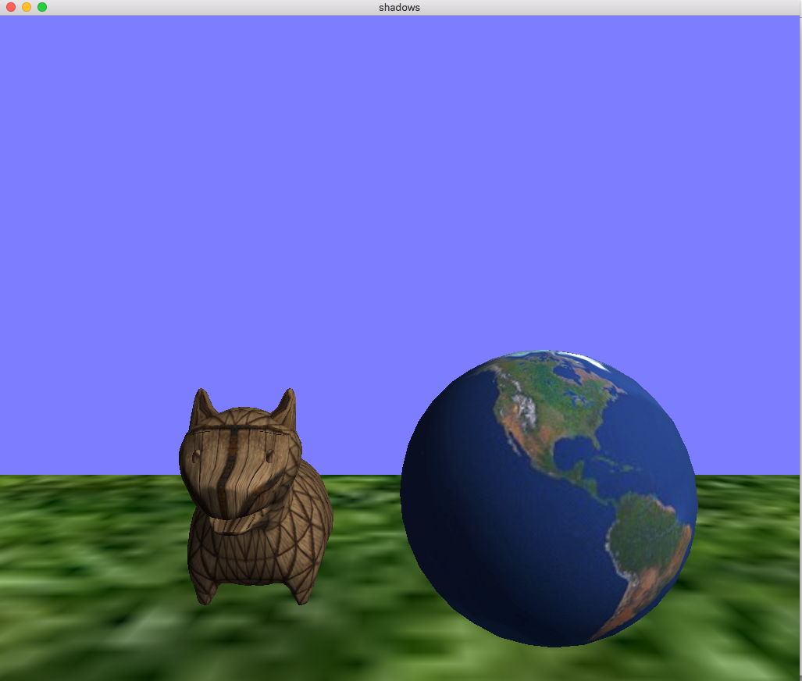
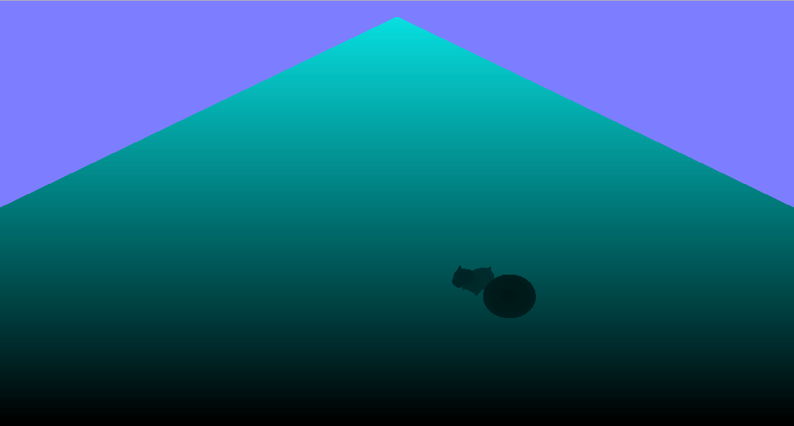
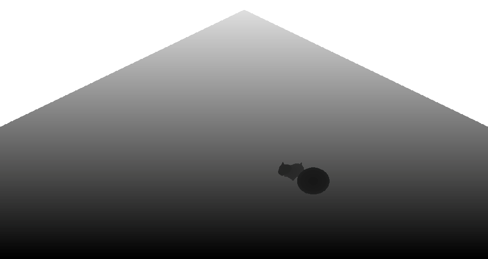
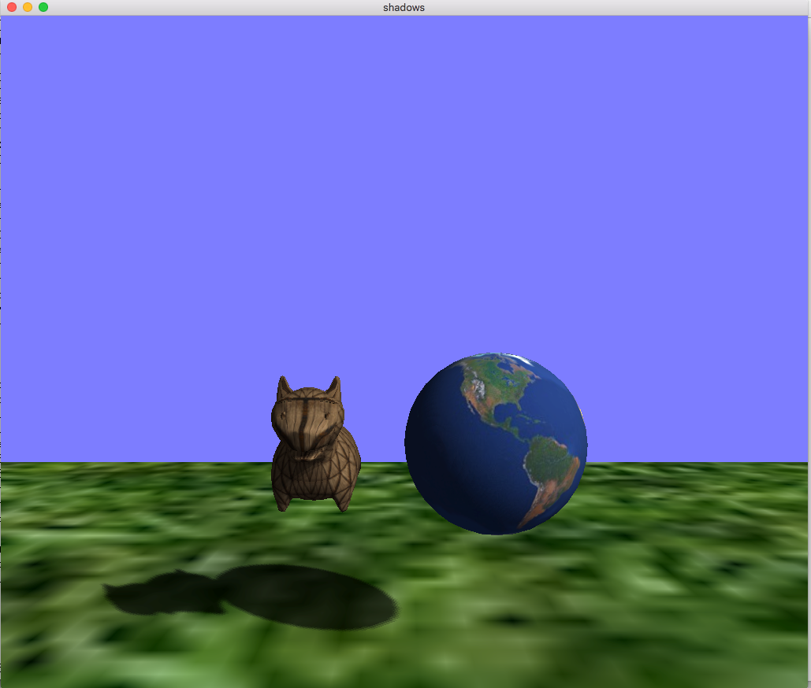

How things start:

{:class="img-thumbnail"}

## Task 1:

Set up the transforms to be able to "draw from the light" - edit:

Fill in `SetLightView` and `SetOrthoMatrix` with reasonable values and send the matrices to the appropriate shaders.

## Task 2:

Once you get the transforms in place - make sure your matrices are right.

Firstm get the geometric debug to show your scene from the light's perspective to work.
In the base code `GEOM_DEBUG` is set to 1, leave it as such and hit the **`l`** key to toggle `DEBUG_LIGHT` on or off.
There are two shader: `depth_vertDebug.glsl` and `depth_fragDebug.glsl`,
that do exactly what the pass through `depth_vert.glsl` and `depth_frag.glsl` do.
However, it outputs a color - this allows you to test if the depth shaders are actually 'seeing' the right thing.
Correct output should look something like:

{:class="img-thumbnail"}

## Task 3:

To test the light's depth map, (toggle `GEOM_DEBUG` to 0, and hit the **`l`** key to toggle `DEBUG_LIGHT` on or off).
There are base shaders: `pass_vert.glsl` and `pass_texfrag.glsl` ("DebugProg"),
that will draw a large quad and texture map on the depth map.
When the light depth's map view to work, it should look something like:

{:class="img-thumbnail"}

## Task 4:

To complete the shadow mapping, you need to edit the final pair of shaders

1. Edit `shadow_vert.glsl` to transform the point into Light space per vertex (hint: what matrix do you need)

2. Edit `shadow_frag.glsl` to complete the shadow depth test:
   1. shift the coordinates from $$ \{-1, 1\} $$ to $$ \{0, 1\} $$
   2. read off the stored depth (`.`) from the ShadowDepth, using the shifted.xy
   3. compare to the current depth (`.z`) of the projected depth
   4. return $$1$$ if the point is shadowed

You can also implement percentage closer shadows, which blend neighboring depth values to scale shadow intensity.

Final shadow mapped look:

{:class="img-thumbnail"}

