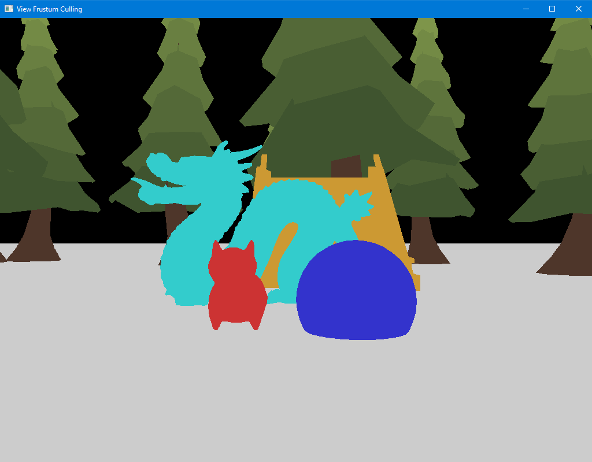

Base Code
---------

When you run the base code, you should see some diffuse shaded spheres moving around slowly.

The base code is rendering a scene into a G-Buffer, then doing a light pass.
However, there is no light code, so the lights are rendered as spheres (in the usual way).

- You can hold **`[H]`** to see the colors in the G-Buffer.
- You can hold **`[J]`** to see the normals in the G-Buffer.
- You can hold **`[K]`** to see the depth in the G-Buffer.
- You can hold **`[L]`** to see the reconstructed world-space positions from the G-Buffer.

All of the debug modes are implemented in `debug_frag.glsl`.

For this workshop, we need to implement all of the deferred shading in `light_frag.glsl`.
We'll also need to do some setup in `main.cpp` pertaining to the lighting pass.

### Light Volumes

{:class="img-thumbnail"}

### G-Buffer Colors

{:class="img-thumbnail"}

### G-Buffer Normals

{:class="img-thumbnail"}

### G-Buffer Depth

{:class="img-thumbnail"}

### G-Buffer Positions

{:class="img-thumbnail"}

