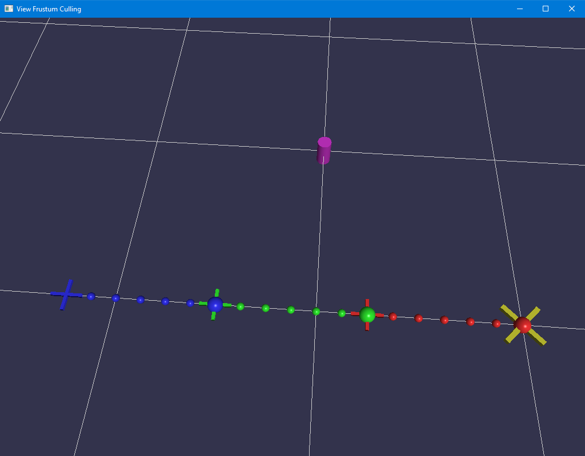

Base Code
---------

When you run the base code, you should see a grid and some geometric primitives.

You can press **`[I]` `[J]` `[K]` `[L]`** to move the magenta cylinder.
This is our goal position for our arm.

Pressing **`[Space]`** will run one step of our Inverse Kinematics solver.

Pressing **`[Enter]`** will attempt to fully solve the IK configuration.
Initially that will fail, since there is no IK code yet!

There is a lot of rendering code in `main.cpp` but we will be implementing IK in `InverseKinematics.h` and `InverseKinematics.cpp`.

{:class="img-thumbnail"}

Today we will be implementing [FABRIK](http://www.andreasaristidou.com/publications/papers/FABRIK.pdf).

Steps
-----

### Step 1

In `InverseKinematics.h`, implement `GetInboardTransformation` and `GetOutboardTransformation`.
We are just computing hierarchical transforms here.

Once this is done, we can now run the "IK Step" and it will do something.
Without IK, this will simply update the inboard/outboard positions of the arm
so that the default position is shown (extending to the left).

### Step 2

In `InverseKinematics.cpp`, implement `FABRIKStepOne` and `FABRIKStepTwo`.

