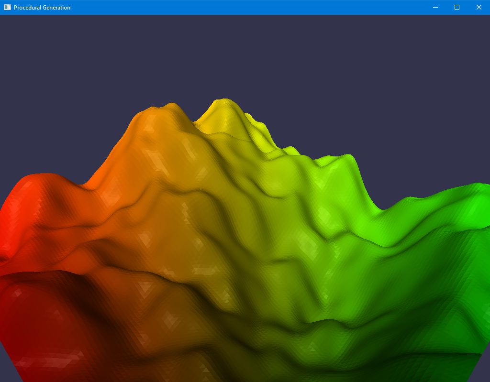

Base Code
---------

When you run the base code, you should some terrain.

{:class="img-thumbnail"}

A framebuffer with "color" and "height" attachments is created.

The shader `noise_frag.glsl` renders into this FBO to produce a texture and heightmap for the terrain.
This shader uses a GLSL noise implementation.

The terrain is rendered using a shader that automatically computes normals.
Other than that it is not noteworthy.

Steps
-----

Change `noise_frag.glsl` to make more interesting terrain.

