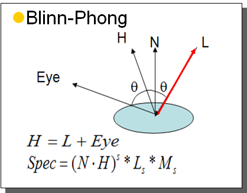

GLSL Review
-----------

Who can tell me what this does?

```glsl
gl_Position = gl_Position.xyww;
```


Lighting and Shading Review
---------------------------

- [471 Color Vision Lecture](https://iondune.github.io/csc471/lectures/15-lighting-1)
- [471 Reflection Models Lecture](https://iondune.github.io/csc471/lectures/16-lighting-2)
- [471 Lighting and Shading Wrapup Lecture](https://iondune.github.io/csc471/lectures/17-lighting-3)



